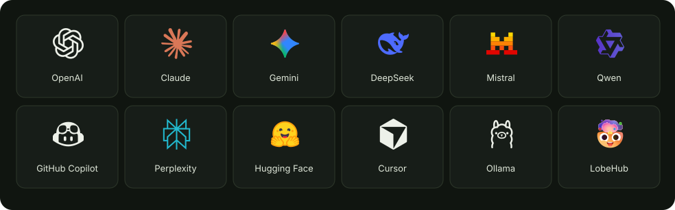

<h1 align="center">Provider Icons</h1>

<p align="center">AI provider and product marks for React, JavaScript, and native apps.</p>

<p align="center">
  <a href="https://agenticdriver.dev/icons"><picture><source media="(prefers-color-scheme: dark)" srcset="https://shieldcn.dev/badge/gallery-browse-A3C85A.svg?variant=outline&amp;mode=dark"></picture></a>
  <a href="https://www.npmjs.com/package/@agenticdriver/provider-icons"><picture><source media="(prefers-color-scheme: dark)" srcset="https://shieldcn.dev/npm/@agenticdriver/provider-icons.svg?logo=npm&amp;variant=outline&amp;mode=dark"></picture></a>
  <a href="docs/installation.md#cdn"><picture><source media="(prefers-color-scheme: dark)" srcset="https://shieldcn.dev/badge/jsDelivr-CDN-E84D3D.svg?logo=jsdelivr&amp;variant=outline&amp;mode=dark"></picture></a>
  <a href="LICENSE"><picture><source media="(prefers-color-scheme: dark)" srcset="https://shieldcn.dev/github/agenticdriver/provider-icons/license.svg?variant=outline&amp;mode=dark"></picture></a>
</p>

<p align="center"><a href="https://agenticdriver.dev/icons">Browse & download</a> · <a href="docs/api.md">API reference</a> · <a href="docs/installation.md">Installation</a> · <a href="CONTRIBUTING.md">Contributing</a></p>



**380 marks · 1,041 SVGs.** Monochrome and colour logos, vector wordmarks,
brand variants, and related product marks in one maintained catalogue.

- **Ready to use:** React components and DOM helpers handle size, layout and unique SVG IDs.
- **Small imports:** named React imports include only their artwork; React is optional.
- **Easy to find:** aliases, localized names, categories and recorded colour palettes.
- **Portable:** standard SVG files and a JSON manifest for any language or UI toolkit.
- **Local by default:** installed icons make no network requests. The core has no runtime dependencies.

## Install

```sh
npm install @agenticdriver/provider-icons
```

This installs the independent icon library. No AgenticDriver SDK is required.
The 1.x API preserves public icon IDs, imports and asset paths.
See the [stability and support policy](docs/stability.md) and [release notes](CHANGELOG.md).

[pnpm, Yarn, Bun and Deno](docs/installation.md#package-managers) ·
[CDN URLs](docs/installation.md#cdn) ·
[GitHub archives and native apps](docs/installation.md#archives-and-native-apps)

## React

```tsx
'use client';

import { Claude } from '@agenticdriver/provider-icons/react';

export default function Example() {
  return <Claude.Combine size={32} mode="color" aria-label="Claude" />;
}
```

Use `Claude`, `Claude.Color`, `Claude.Text`, `Claude.Combine`, or `Claude.Avatar`.
Available layouts follow the real artwork. React 18.3.1 and 19 are supported;
monochrome icons inherit `currentColor`.

## JavaScript

```js
import { mountProviderIcon } from '@agenticdriver/provider-icons/dom';

mountProviderIcon('#provider-icon', 'claude', {
  style: 'color', size: 32, label: 'Claude',
});
```

Add `<span id="provider-icon"></span>` to your page. For an SVG string, use
`providerIconSvg` from `@agenticdriver/provider-icons/svg`.

## Find the right mark

```js
import { searchProviderIcons } from '@agenticdriver/provider-icons';

searchProviderIcons('千问'); // Qwen
searchProviderIcons('Nemotron'); // Nvidia
searchProviderIcons('claude code', { category: 'application' });
```

The [gallery](https://agenticdriver.dev/icons) offers category filters, shareable
selections, copyable components, SVG/PNG/WebP downloads, and brand colours.
Agents can read the [usage guide](https://agenticdriver.dev/icons/skill.md) or
[generated catalogue](https://agenticdriver.dev/icons/catalogue.json).

## Documentation

| Guide | Covers |
| --- | --- |
| [API reference](docs/api.md) | React, DOM, SVG, search, colour metadata and fallbacks |
| [Installation](docs/installation.md) | Package managers, CDNs, archives, updates and removal |
| [Stability and support](docs/stability.md) | 1.x compatibility, supported runtimes and manifest schema |
| [Changelog](CHANGELOG.md) | Release notes and migration guidance |
| [Contributing](CONTRIBUTING.md) | Development, source updates and verification |
| [Releasing](docs/releasing.md) | Tested archives, npm trusted publishing and distribution |
| [Upstream contributions](docs/lobehub-pull-requests.md) | Reviewed LobeHub pull requests and artwork omissions |

## Credits and license

The library is [MIT licensed](LICENSE). Most artwork comes from
[LobeHub Icons](https://github.com/lobehub/lobe-icons), with pinned source
revisions and attribution in [NOTICE](NOTICE), [licenses](licenses/), and
[provenance.json](provenance.json).

Names and logos belong to their respective owners. Inclusion does not imply
endorsement or AgenticDriver model/provider support. The dated
[brand-colour research](https://github.com/agenticdriver/provider-icons/tree/main/research/brand-colours)
is separate from the released colour metadata.
